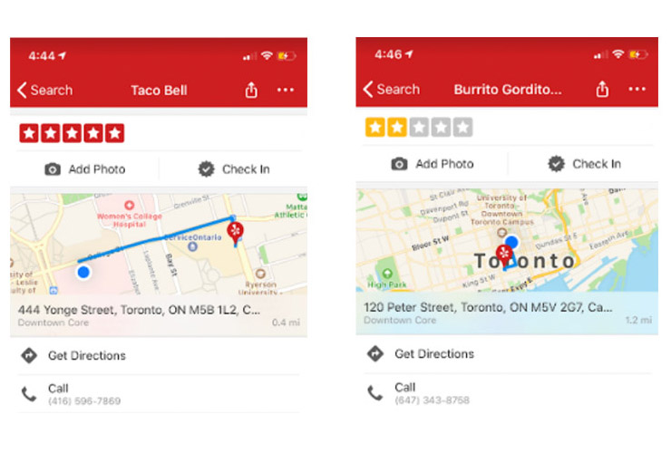

# Minority Community by Open Database


## 1. Brief

By utilizing blockchain tech, it's possible to build open databases with community's collaboration independent from internet tycoons. Powered by such databases, developers from different culture groups can reduce their cost in boostrapping their web applications to better serve specific audiences. Local bussiness and minorities would get more exposure and connections. 

In the submission, we have:

1. A decentrialized Escrow and Review smart contract(SC) built upon [NEO](http://neo.org/) blockchain infrastructure. 
2. [An ordering iOS App](https://github.com/norchain/ElevateHackathon/tree/master/ios) built upon mentioned SC, utilizing **TD's payment API** for payment, while joins the blockchain data and **user profile proivded by TD's API** to do the recommandation. 
3. [An recommandation web app](https://github.com/norchain/ElevateHackathon/tree/master/webapp) built upon mentioned SC, using the blockchain data to do the recommandation. 


## 2. The Challenge

**Status**

Alice wants some authentic Maxican food and gets below search result from a popular recommendation app.



Assume the result is simply based on the majority's gentrified favours, without any centralized controversial optimization algorithm, the big Q is:

```
In the data-driven era, how would local minority services, businesses and culture better dis with their lovers?
```


## 3. The Experiment

